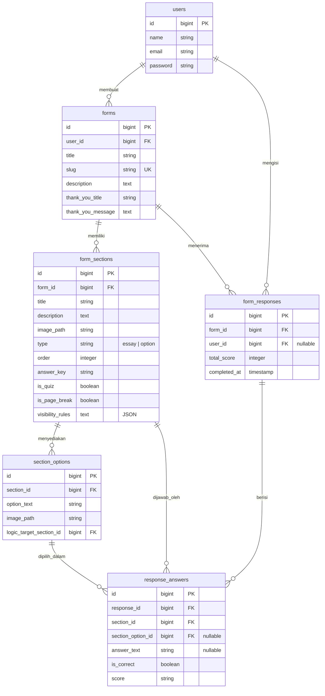

# formKraft 📝

**formKraft** adalah platform pembuat formulir dan kuis dinamis (Form & Quiz Builder) berbasis web dengan arsitektur terpisah (*decoupled*): Laravel 13 API sebagai *backend* dan React 19 Single Page Application (SPA) sebagai *frontend*.

Platform ini memungkinkan pengguna untuk membuat kuesioner, formulir kontak, atau kuis interaktif dengan penentuan kunci jawaban dan penilaian otomatis.

---

## 🛠️ Tech Stack (Teknologi yang Digunakan)

### Backend (Laravel 13 API)
- **Framework**: Laravel 13.x (PHP 8.3+)
- **Authentication**: Laravel Sanctum (menggunakan Bearer Token)
- **Database**: SQLite (Default)
- **Testing**: PHPUnit
- **Code Styling/Linting**: Laravel Pint
- **Logging**: Laravel Pail

### Frontend (React 19 SPA)
- **Framework**: React 19.x (Vite, React Router 7)
- **API Client**: Axios dengan interceptor token Sanctum otomatis
- **State Management**: React Hooks (`useState`, `useEffect`)
- **Styling**: Custom CSS Design System (tanpa utility CSS framework, semua diatur dalam `src/App.css` menggunakan CSS variables)
- **Libraries**:
  - `recharts` untuk visualisasi grafik analisis respon kuis/formulir
  - `@dnd-kit` untuk fitur drag-and-drop dalam pembuatan formulir

---

## 🌟 Fitur Utama (Key Features)

1. **Autentikasi Pengguna**:
   - Registrasi, Login, dan Logout berbasis token Sanctum.
   - Restriksi halaman dashboard & form builder khusus pengguna terautentikasi.
2. **Form & Quiz Builder**:
   - **Pembuatan Formulir**: Judul, Deskripsi, dan Slug kustom yang unik.
   - **Form Sections**: Menambahkan bagian/pertanyaan formulir dengan tipe esai (`essay`) atau pilihan ganda (`option`).
   - **Quiz Mode**: Kemampuan menandai bagian sebagai kuis, menyetel kunci jawaban (`answer_key`), dan memberikan skor otomatis pada jawaban responden.
   - **Unggah Gambar**: Dukungan unggah gambar pada tingkat pertanyaan (section) maupun tingkat pilihan jawaban (option).
   - **Pengurutan (Reordering)**: Mengatur urutan section secara fleksibel.
   - **Halaman Terima Kasih Kustom**: Judul dan pesan khusus yang muncul setelah formulir berhasil dikirim.
3. **Logika & Kondisional Pintar**:
   - **Visibility Rules**: Menyembunyikan atau memunculkan suatu bagian berdasarkan pilihan jawaban responden di bagian sebelumnya (dievaluasi di sisi klien).
   - **Logic Jump (Logic Target Section)**: Lompat ke bagian tertentu setelah memilih opsi jawaban tertentu.
   - **Page Breaks**: Memecah formulir menjadi beberapa halaman/langkah (multi-page form).
4. **Form Filling (Pengisian Formulir)**:
   - Akses publik melalui slug formulir (misalnya `/:slug/fill`).
   - Responden bisa berupa pengguna terdaftar maupun tamu/anonim (guest response).
   - Tampilan multi-halaman dinamis sesuai aturan visibilitas dan lompatan logika.
5. **Analisis Jawaban & Analytics**:
   - **Dashboard**: Melihat daftar formulir yang dimiliki pengguna.
   - **Summary (Ringkasan)**: Melihat grafik statistik pilihan jawaban menggunakan Recharts dan rata-rata skor kuis.
   - **Submission Log**: Melihat riwayat jawaban responden.
   - **Detail Respon**: Melihat jawaban responden secara spesifik, membandingkannya dengan kunci jawaban jika itu kuis, beserta detail skor yang didapatkan.
   - **Ekspor CSV**: Mengunduh seluruh respon formulir ke format CSV.

---

## 📂 Struktur Folder Proyek

```text
formKraft/
├── backend/            # Laravel 13 API
│   ├── app/
│   │   ├── Http/Controllers/   # API Controller (Auth, Forms, Sections, dll.)
│   │   └── Models/             # Eloquent Models (User, Form, FormSection, dll.)
│   ├── database/
│   │   └── migrations/         # Skema Database SQLite
│   ├── routes/
│   │   └── api.php             # Rute Endpoint API
│   └── tests/                  # Fitur & Unit Testing PHPUnit
│
└── frontend/           # React 19 SPA (Vite)
    ├── src/
    │   ├── api/                # Konfigurasi Axios & API Client
    │   ├── components/         # Reusable UI Components
    │   ├── pages/              # Halaman-Halaman (Dashboard, Builder, Fill, dll.)
    │   ├── utils/              # Helper autentikasi & token localStorage
    │   ├── App.jsx             # React Router Route Mappings
    │   └── App.css             # Desain Sistem CSS (Global & Layout)
    └── vite.config.js          # Konfigurasi Vite
```

---

## 📊 Skema Database (Database Schema)

Hubungan antartabel dalam database SQLite dapat digambarkan sebagai berikut:



---

## 🚀 Panduan Memulai Cepat (Quick Start)

### Persyaratan Awal (Prerequisites)
- PHP >= 8.3
- Composer
- Node.js >= 18
- npm atau yarn
- SQLite

---

### Langkah Setup Backend

1. Buka folder `backend`:
   ```bash
   cd backend
   ```
2. Jalankan perintah inisialisasi setup (ini akan menginstal dependensi PHP, membuat file `.env`, men-generate key, membuat file database SQLite, menjalankan migrasi, dan mem-build aset awal):
   ```bash
   composer setup
   ```
3. Untuk menjalankan server development, antrean queue, Laravel Pail log, dan Vite secara bersamaan:
   ```bash
   composer dev
   ```
   *Backend API akan berjalan di `http://localhost:8000`.*

4. **Testing & Linting (Backend)**:
   - Menjalankan PHPUnit tests:
     ```bash
     composer test
     ```
   - Menjalankan linter code Laravel Pint:
     ```bash
     ./vendor/bin/pint
     ```

---

### Langkah Setup Frontend

1. Buka folder `frontend`:
   ```bash
   cd frontend
   ```
2. Instal semua dependensi Node:
   ```bash
   npm install
   ```
3. Jalankan server development Vite:
   ```bash
   npm run dev
   ```
   *Frontend SPA akan berjalan di `http://localhost:5173` (atau port lain yang ditunjukkan di terminal).*

4. **Linting (Frontend)**:
   - Menjalankan ESLint check:
     ```bash
     npm run lint
     ```

---

## 🔀 Pemetaan Rute Frontend (Client-Side Routes)

| Path / URL | Halaman | Deskripsi | Hak Akses |
|---|---|---|---|
| `/` | `Login` | Halaman login bagi pengguna | Publik |
| `/register` | `Register` | Halaman pendaftaran akun baru | Publik |
| `/dashboard` | `Dashboard` | Dashboard utama pengguna untuk mengelola form mereka | Terautentikasi (Sanctum) |
| `/:slug` | `FormBuilder` | Halaman editor untuk mendesain bagian & opsi form | Terautentikasi (Sanctum) |
| `/:slug/responses` | `FormResponses` | Analisis hasil pengisian formulir & ringkasan grafik | Terautentikasi (Sanctum) |
| `/:slug/fill` | `FormFill` | Halaman pengisian formulir untuk responden | Publik |
| `/:slug/result/:id` | `FormResult` | Hasil ringkasan setelah responden mengirim jawaban | Publik / Terautentikasi |
| `/result/:id` | `ResponseDetail` | Detail jawaban responden tertentu dibandingkan kunci | Terautentikasi (Sanctum) |

---

## 📡 Referensi Endpoint API

Berikut adalah beberapa endpoint API utama yang dipetakan pada `backend/routes/api.php`:

### Autentikasi (`/api/auth/*`)
- `POST /api/auth/register` - Pendaftaran akun baru.
- `POST /api/auth/login` - Login untuk mendapatkan token Sanctum.
- `POST /api/auth/logout` - Logout dan hapus token saat ini (Memerlukan Token).

### Pengelolaan Form (`/api/forms/*`)
- `GET /api/forms` - Mengambil semua form milik user saat ini (Memerlukan Token).
- `POST /api/forms` - Membuat form baru (Memerlukan Token).
- `GET /api/forms/{slug}` - Detail form untuk builder/dashboard (Memerlukan Token).
- `PUT /api/forms/{slug}` - Memperbarui judul/deskripsi form (Memerlukan Token).
- `DELETE /api/forms/{slug}` - Menghapus form (Memerlukan Token).

### Pengisian & Respon (`/api/forms/{slug}/*`)
- `GET /api/forms/{slug}/fill` - Mengambil detail form lengkap dengan kuis, halaman, dan opsi untuk diisi responden (Publik).
- `POST /api/forms/{slug}/submit` - Mengirim jawaban dari responden (Publik/Tamu).
- `GET /api/results/{slug}/{responseId}` - Melihat hasil kuis/jawaban oleh responden umum (Publik).
- `GET /api/forms/{slug}/summary` - Mengambil ringkasan statistik respon dan grafik (Memerlukan Token).
- `GET /api/forms/{slug}/export/csv` - Ekspor respon ke CSV (Memerlukan Token).
